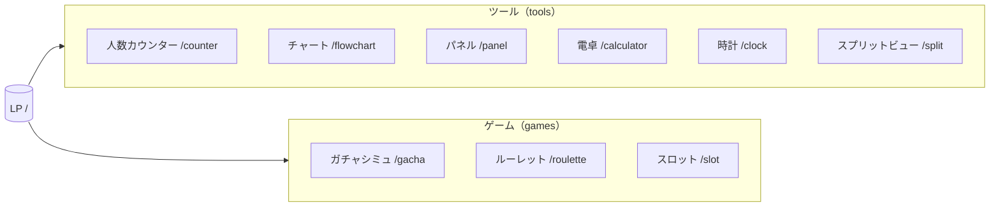
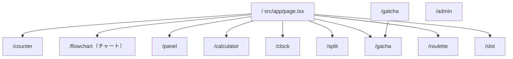
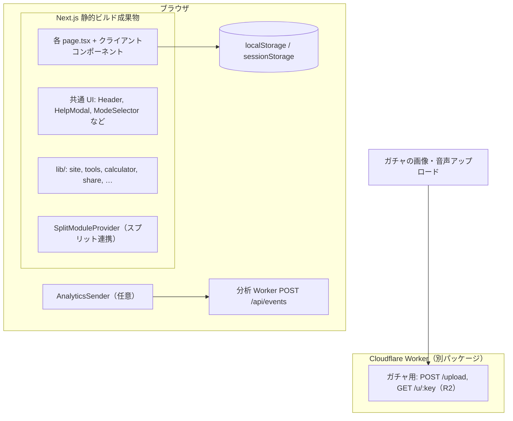
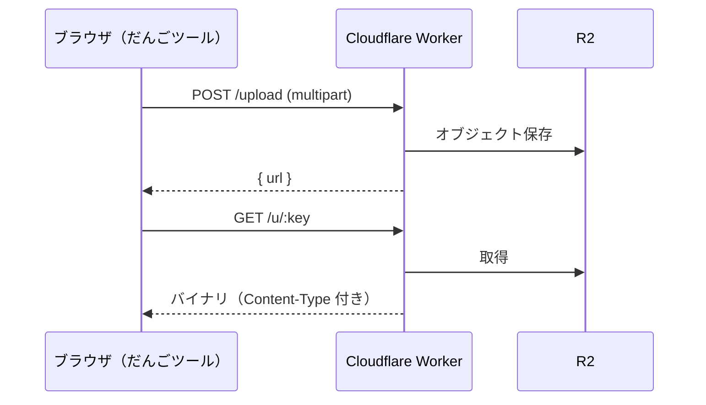

# だんごツール — コンセプトと実装概要

このドキュメントは、[だんごツール](https://dango-tool.vercel.app)（リポジトリ名: 人数カウントアプリ）の**プロダクトコンセプト**と**実装の骨格**を、図で追いやすくまとめたものです。ソースの正は `src/` および `my-worker/` です。

---

## 1. コンセプト

### 1.1 何をするサービスか

- **名称**: だんごツール（`src/lib/site.ts` の `SITE_CONFIG`）
- **一言**: 配信者・クリエイター向けの **Web ツールキット**。登録不要で、ブラウザからそのまま使える。
- **初期の核**: 人数カウンター。現在は **複数ツールを同一サイト・同一デザイン言語**で提供している。

### 1.2 設計上の方針（コードから読み取れるもの）

| 方針 | 実装での表れ |
|------|----------------|
| 単一の「ツール一覧」ソース | `src/lib/tools.ts` の `TOOLS` — LP・モード切替・sitemap・JsonLd で共有 |
| オフライン寄り・静的配信 | `next.config.ts` の `output: "export"`（静的エクスポート） |
| 本番の HTTP ヘッダ・リダイレクト | Vercel では [vercel.json](../vercel.json) の `headers` / `redirects`。`output: "export"` では `next.config` に `headers` を置かない |
| 誤記 URL `/gatcha` | [src/app/gatcha/page.tsx](../src/app/gatcha/page.tsx) で `/gacha` へ遷移。Vercel では `vercel.json` のリダイレクトも併用 |
| PWA | `public/manifest.json`、LP のインストール案内コンポーネント |
| ヘルプと実装の一致 | 各ルートの説明は `src/components/HelpModal.tsx` の `getContent()` が正 |
| 計測は任意 | `NEXT_PUBLIC_ANALYTICS_ENDPOINT` があるときだけ `AnalyticsSender` が送信 |

### 1.3 ツール一覧（カテゴリ）

`TOOLS` では **tools**（実用ツール）と **games**（ゲーム系）に分類されている。



---

## 2. ルーティングと画面の関係

Next.js App Router 下の `src/app/*/page.tsx` が各ツールのエントリ。トップは LP。



- **リダイレクト**: `/gatcha` → `/gacha`（[src/app/gatcha/page.tsx](../src/app/gatcha/page.tsx)。Vercel では [vercel.json](../vercel.json) の `redirects` も併用し `/gatcha/:path*` もサーバ側で寄せる）
- **管理画面** `/admin`: 利用状況などの内部向け。`AnalyticsSender` では計測対象外。

---

## 3. フロントエンド・アーキテクチャ

### 3.1 全体レイヤ（概念図）



### 3.2 ルートレイアウトで常に載るもの

`src/app/layout.tsx` より:

- **JsonLd**: 構造化データ
- **SplitModuleProvider**: スプリット画面で「どのモジュールがアクティブか」を共有（`src/context/SplitModuleContext.tsx`）
- **AnalyticsSender**: パス変更時にページビュー送信（環境変数あり時のみ実質動作）
- **HelpButton**: ルートに応じたヘルプ

### 3.3 スプリットビューとの連携

`SplitModuleType` は `src/context/SplitModuleContext.tsx` より  
`"counter" | "chart" | "gacha" | "roulette" | "slot" | "calculator" | "clock" | "panel"`（チャートは URL が `/flowchart` で id は `chart`）。  
`/split` ではタブ等でモジュールを切り替え、コンテキスト経由で他画面と状態の扱いを揃えられる設計。

```text
  ┌──────────────────────────────────────┐
  │  RootLayout                          │
  │    SplitModuleProvider               │
  │      ┌─────────────┐  /split 上で     │
  │      │ activeModule│◄── タブ切替で更新 │
  │      └─────────────┘                  │
  └──────────────────────────────────────┘
```

### 3.4 主要ライブラリ（`package.json` より）

| 用途 | 依存 |
|------|------|
| UI・ルーティング | Next.js 16.2.x, React 19, Tailwind 4（正確な版は `package.json`） |
| アニメーション | framer-motion |
| フローチャート編集 | @xyflow/react |
| ドラッグ並べ替え | @dnd-kit/* |
| 画像出力 | html-to-image |
| ZIP | jszip |
| チャート | recharts |

---

## 4. ディレクトリの見方

| パス | 役割 |
|------|------|
| `src/app/` | ルート別ページ・レイアウト |
| `src/components/` | 共通・ツール別 UI（`flowchart/`, `gacha/`, `roulette/`, `slot/` など） |
| `src/lib/` | ドメインロジック・定数（`tools.ts`, `site.ts`, `calculator.ts`, `share.ts` 等） |
| `src/hooks/` | ローカルストレージやスタイル用フック |
| `src/context/` | React コンテキスト（スプリット） |
| `public/` | 静的アセット、PWA manifest、音声など |
| `my-worker/` | Cloudflare Worker（ガチャ景品ファイルのアップロード・R2 プロキシ） |
| `scripts/` | OGP キャプチャ等のメンテ用スクリプト |

---

## 5. バックエンド・外部連携

### 5.1 静的サイト本体

- **ホスティング想定**: Vercel 等で **静的ファイル**として配信（`output: "export"`）。
- **サーバーサイド API は同梱しない**（Next の API Routes はこの構成では中心にならない）。
- **HTTP ヘッダ・リダイレクト**: 静的成果物だけでは付かないため、Vercel では `vercel.json` で指定。その他ホストでは同等のヘッダを CDN やサーバー設定で付与する。

### 5.2 Cloudflare Worker（`my-worker/`）

- **目的**: ガチャ機能向けに **画像・音声を R2 にアップロード**し、**署名付きに近いキーで GET プロキシ**する。
- **CORS**: 本番ドメイン・ローカルホストを許可（`my-worker/src/index.ts` の `ALLOWED_ORIGINS`）。
- **フロントからの接続**: 本番の CSP は `vercel.json` の `Content-Security-Policy` において `connect-src` に Worker の URL（例: `https://my-worker.gacha-upload.workers.dev`）が含まれる。Worker 側の許可オリジンは `my-worker/src/index.ts` の `ALLOWED_ORIGINS`。



### 5.3 アクセス解析（任意）

- `src/lib/analytics.ts`: `NEXT_PUBLIC_ANALYTICS_ENDPOINT` が設定されているとき、`sendBeacon` / `fetch` で **ページビュー・セッション開始**を送信。
- 匿名 ID は `localStorage`（キー `dango_analytics_id`）。

---

## 6. セキュリティ・プライバシー（実装レベル）

- **CSP ほかセキュリティヘッダ**: Vercel デプロイ時は [vercel.json](../vercel.json) の `headers` で `/(.*)` に対し Content-Security-Policy、`X-Frame-Options`、`X-Content-Type-Options`、`Referrer-Policy` を付与。`sitemap.xml` / `robots.txt` 用の `Content-Type` も同ファイルで指定。
- **クリックジャッキング対策**: `X-Frame-Options: DENY` と CSP の `frame-ancestors 'none'`（いずれも `vercel.json`）。
- **個人データ**: アカウント登録なし。ツール設定は主にブラウザ側ストレージに保持する設計が多い（ツールごとにキーは各コンポーネント・フック側）。

---

## 7. 開発者向けメモ

- **ツール追加時**: `src/lib/tools.ts` の `TOOLS` に 1 件追加し、必要なら `HelpModal.tsx`・`SplitModuleType`・sitemap 連携を追随（`.cursor/rules` のヘルプ・更新履歴・**docs 同期**ルール参照）。
- **OGP 画像**: `public/ogp.png`。再生成は `npm run ogp:capture`（`scripts/capture-ogp.mjs`）。
- **既存の運用ドキュメント**: `docs/git-config-for-vercel.md`（Vercel 向け Git 設定）。

---

## 8. 図の凡例

- **Mermaid** は GitHub や多くの Markdown ビューアで表示可能です。
- ルート名・ファイルパスは実装時点のものです。変更した場合は本書と `tools.ts`・`vercel.json`・`next.config.ts` を突き合わせてください（`.cursor/rules/docs-sync.mdc`）。
