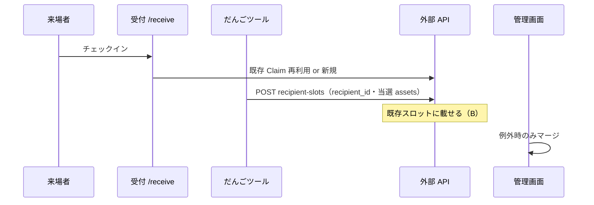

# ガチャ × だんごシェアリンク連携

開発者向け。ユーザー向けの操作説明は [HelpModal.tsx](../src/components/HelpModal.tsx)（`/gacha`）が正。

**実装計画（受付入口・B 方針）**: [file-share-app/docs/gacha-reception-integration-plan.md](../../file-share-app/docs/gacha-reception-integration-plan.md)  
エッジケース検証・API 変更・フェーズ一覧は計画書を参照。

## 設計原則（ベストプラクティス）

| 関心事 | 正（SSOT） | だんごツール |
|--------|------------|--------------|
| 同一人物 | だんごシェアリンク **受取人名簿** `recipients` | `Player.linkedRecipientId`（任意コピー） |
| 会場の入口 | **共通受付 URL**（`/receive/{token}`） | 配布タブに受付 URL を表示（個別 URL は渡さない） |
| キャンペーンへの載せ方 | 受付チェックイン / ガチャ API（既存枠解決） | `POST recipient-slots` |
| 同一キャンペーン内の重複枠 | だんごシェアリンク **マージ** UI（例外） | 検知表示のみ（`GET recipient-slots`） |
| ガチャ・履歴 | ツール `gacha-players` | 正 |
| 配布ファイル | だんごシェアリンク `claims` / `*_assets` | 冪等 POST で更新 |
| セキュリティ | **限定配布**（`security_level = high`） | 連携 ON で固定 |
| 配布の手渡し | 連携 ON では **非推奨** | `per_link` 専用の `claim_url` コピーは副次 |

**2軸を混同しない**: `distribution_mode` は「入口 UX」、`security_level` は「受取の厳しさ」。連携 ON では **受付 + 限定** を固定する（計画書参照。未リリース時は `per_link` 固定のコードが残る場合あり）。

### 推奨運用（人物・入口）

1. 受取人名簿にリスナーを登録（過去キャンペーンと共有可）
2. ガチャのプレイヤーに **名簿を紐づけ**（イベント前。二重枠を減らす）
3. 会場では **受付 QR** のみ案内する（運営が個別 URL を配らない）
4. 抽選後、だんごツールが当選ファイルを **既存枠に同期**（`recipient_id` 解決）
5. 初来などで枠が二重になったら → だんごシェアリンク管理画面で **マージ**（例外・数十人規模なら許容）
6. プレイヤー削除は **ガチャ連携の解除**（`DELETE mode=detach`）。受付済みの受取枠は原則残す

**避ける組み合わせ（二重枠が増える）**

- 名簿からキャンペーンに先載せ **かつ** ガチャで別枠を作る（名簿紐づけなし）
- 連携中に「手渡し用」として個別 URL 運用を主導線にする

## 連携ライフサイクル（三層）

| 層 | 保存 | 解除のしかた |
|----|------|----------------|
| **接続** | だんごシェアリンク `integration_access_tokens` / ツール `gacha-integration-config` | ツール「接続を解除」または だんごシェアリンク トークン失効 |
| **紐づけ** | ツール `gacha-pool.linkedCampaignId` | 配布タブでキャンペーン変更（景品紐づけリセット） |
| **配布** | だんごシェアリンク Claim / スロット | プレイヤー削除（detach）・管理画面マージ |

だんごシェアリンクの **「ツール連携を一時停止」**（`is_external_linked = false`）は接続ではなくキャンペーン単位の書き込み停止。外部 API の POST/PUT/DELETE は `403 integration_paused`。GET は継続。再開は管理画面の **「ツール連携を再開」**。

発行スコープ（既定）: `campaigns:read`, `campaigns:write`, `claims:issue`。`/sync` には `gacha-integration-config` を含めない（別端末では再 OAuth）。

### Phase 2（運用導線）

- **マージ deep link**: `{だんごシェアリンク}/campaigns/{id}?focus_external_tx=gacha-{poolId}-player-{playerId}`
- **再接続**: ツール `useIntegrationConnectionState` → `needs_reconnect` 時バナー
- **トークン最終利用**: `integration_access_tokens.last_used_at`
- **レート制限**: トークンあたり 120 req/min → `429 rate_limited`

### 連携トークン（OAuth）

**同意画面を出すタイミング（UX）**

| 状況 | 挙動 |
|------|------|
| 配布タブ「連携を開始する」 | だんごシェアリンク `/settings/integrations/authorize` へ（推奨） |
| `?campaign_id=` deep link・トークンなし | 自動 OAuth **しない**。配布タブ＋トーストで手動連携を案内 |
| API 401 / トークン失効 | authorize へ自動遷移（再接続） |
| 許可済み・トークンあり | 同意画面は出さない |

## 役割分担（API）

| 領域 | 備考 |
|------|------|
| プレイヤー一覧・抽選履歴 | `localStorage` `gacha-players` |
| 受取人スロット・同期 | 外部 API `recipient-slots`（POST/GET/DELETE） |
| 品目↔アセット | `pool.items[].linkedAssetId` + `gacha-config` |

## 配布ファイルの選び方（当選ベース）

だんごツールは **常に当選ベース（fail closed）** で `campaign_asset_ids` を送る。

| ツール側 | POST body | だんごシェアリンク |
|----------|-----------|--------------|
| マッピング済み当選のみ | `campaign_asset_ids: [id,…]` | 指定アセットのみ Claim に付与 |
| 当選なし / 未マッピングのみ | `campaign_asset_ids: []` | ファイル0（`unlinked`） |
| フィールド省略 | — | レガシー（全アセット・非推奨） |

実装: `collectDistributionAssetIds()` → `issueClaimForPlayer()`。

### 抽選前確認（一部未紐づけ）

`PartialUnmappedPullDialog` — 実装: [gachaPullGuard.ts](../src/lib/gachaPullGuard.ts)

## 結びつけキー

- **冪等 ID**: `gacha-{poolId}-player-{playerId}` — `buildGachaPlayerExternalTransactionId()`
- **キャンペーン**: `pool.linkedCampaignId`
- **名簿（推奨）**: `Player.linkedRecipientId` → POST body `recipient_id`
- **表示スコープ**: `playersForLinkedPool()` + `issuedCampaignId`

## 配布タブ UI（だんごツール）

- **ツール主導**: 品目作成 → 配布タブで紐づけ
- **だんごシェアリンク主導**: ファイル登録 → 「アセットを再取得」
- **受付 URL**: 連携キャンペーンの共通入口（計画書 Phase 2）
- マッピング保存時: デバウンス後 `PUT gacha-config` → 当選プレイヤーへ `recipient-slots` 再 POST

## 同期の方向

- **ツール → だんごシェアリンク**: POST、リネーム、DELETE（detach 既定）
- **だんごシェアリンク → ツール**: `gacha-config` / `assets`
- **人物の統合**: 名簿 + マージ（ツールは指示しない）

## 主要 API（file-share-app）

| メソッド | パス | 用途 |
|----------|------|------|
| GET | `/api/v1/external/recipients` | 名簿一覧 |
| GET | `.../recipient-slots?external_transaction_id=` | リンク確認 |
| POST | `.../recipient-slots` | 枠解決・当選同期 |
| DELETE | `.../recipient-slots?external_transaction_id=&mode=detach\|purge` | プレイヤー削除 |
| PUT | `.../gacha-config` | ガチャ構成 |
| POST | `/api/public/campaigns/{token}/check-in` | 受付 |

## ツール側のリンク状態

- `usePlayerLinkStatuses`: GET `linked` + `linked_asset_count`（`claim_url` 必須としない — 計画書 Phase 2）
- 配布モーダル: 名簿選択 → `linkedRecipientId` → 再 POST
- 入口: プレイヤータブ配布アイコン / `PlayerHistoryCard` リンクアイコン

## 関連ファイル

**だんごツール**

- [src/lib/gachaDistribution.ts](../src/lib/gachaDistribution.ts)
- [src/app/gacha/hooks/useGachaEngine.ts](../src/app/gacha/hooks/useGachaEngine.ts)
- [src/components/gacha/GachaDistributionPanel.tsx](../src/components/gacha/GachaDistributionPanel.tsx)

**だんごシェアリンク**

- [src/lib/campaigns/external-link-mode.ts](../../file-share-app/src/lib/campaigns/external-link-mode.ts)
- [src/app/api/v1/external/campaigns/[campaignId]/recipient-slots/route.ts](../../file-share-app/src/app/api/v1/external/campaigns/[campaignId]/recipient-slots/route.ts)
- [src/lib/claims/find-claim-for-listener-resume.ts](../../file-share-app/src/lib/claims/find-claim-for-listener-resume.ts)
- [docs/gacha-reception-integration-plan.md](../../file-share-app/docs/gacha-reception-integration-plan.md)
