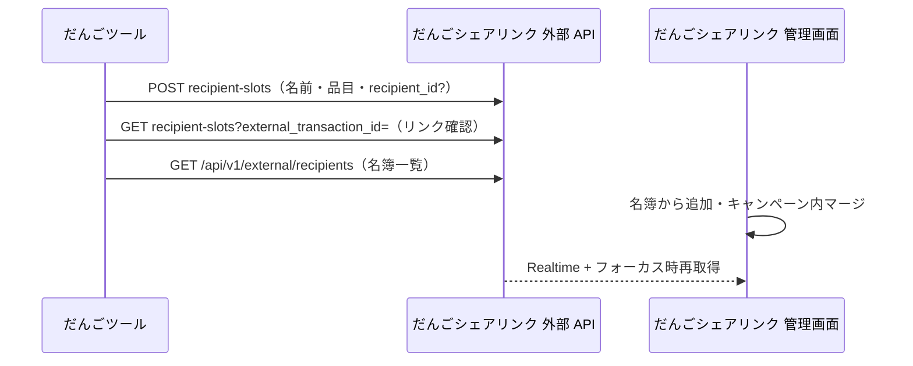

# ガチャ × だんごシェアリンク連携

開発者向け。ユーザー向けの操作説明は [HelpModal.tsx](../src/components/HelpModal.tsx)（`/gacha`）が正。

## 設計原則（ベストプラクティス）

| 関心事 | 正（SSOT） | だんごツール |
|--------|------------|--------------|
| 同一人物 | だんごシェアリンク **受取人名簿** `recipients` | `Player.linkedRecipientId`（任意コピー） |
| キャンペーンへの載せ方 | 名簿から追加 / ガチャ API / チェックイン | `POST recipient-slots` |
| 同一キャンペーン内の重複枠 | だんごシェアリンク **マージ** UI | 検知表示のみ（`GET recipient-slots`） |
| ガチャ・履歴 | ツール `gacha-players` | 正 |
| 配布 URL・ファイル | だんごシェアリンク `claims` / `*_assets` | 冪等 POST で更新 |

**推奨運用（人物の統合）**

1. 受取人名簿にリスナーを登録（過去キャンペーンと共有可）
2. キャンペーンに **名簿から** 受取人を追加（ツール不要）
3. ガチャでプレイヤー追加 → 必要ならプレイヤーに **名簿を紐づけ**（二重枠を減らす）
4. 同じキャンペーンで枠が二重になったら → だんごシェアリンク 管理画面で **マージ**
5. ツールは当選品目・表示名を **同期** するだけ

別キャンペーンをツールから直接マージ・結合する必要はない。

## 連携ライフサイクル（三層）

| 層 | 保存 | 解除のしかた |
|----|------|----------------|
| **接続** | だんごシェアリンク `integration_access_tokens` / ツール `gacha-integration-config` | ツール「接続を解除」または だんごシェアリンク トークン失効 |
| **紐づけ** | ツール `gacha-pool.linkedCampaignId` | 配布タブでキャンペーン変更（景品紐づけリセット） |
| **配布** | だんごシェアリンク Claim / ツール `issuedClaimUrl` | プレイヤー削除・だんごシェアリンクでマージ |

だんごシェアリンクの **「ツール連携を一時停止」**（`is_external_linked = false`）は接続ではなくキャンペーン単位の書き込み停止。外部 API の POST/PUT/DELETE は `403 integration_paused`。GET は継続。再開は管理画面の **「ツール連携を再開」**。

発行スコープ（既定）: `campaigns:read`, `campaigns:write`, `claims:issue`。`/sync` には `gacha-integration-config` を含めない（別端末では再 OAuth）。

### Phase 2（運用導線）

- **マージ deep link**: `{だんごシェアリンク}/campaigns/{id}?focus_external_tx=gacha-{poolId}-player-{playerId}` — ワークフロー API が `externalTransactionId` を返す。受取人カードを強調スクロール。
- **再接続**: ツール `useIntegrationConnectionState` → `needs_reconnect` 時バナー。`/sync` 取り込み後も同条件で案内。
- **トークン最終利用**: だんごシェアリンク `integration_access_tokens.last_used_at`（Bearer 検証成功時に更新）。
- **レート制限**: トークンあたり 120 req/min → `429 rate_limited`。

### 連携トークン（OAuth）

**同意画面を出すタイミング（UX）**

| 状況 | 挙動 |
|------|------|
| 配布タブ「連携を開始する」 | だんごシェアリンク `/settings/integrations/authorize` へ（推奨） |
| `?campaign_id=` deep link・トークンなし | 自動 OAuth **しない**。配布タブ＋トーストで手動連携を案内 |
| API 401 / トークン失効 | authorize へ自動遷移（再接続） |
| 許可済み・トークンあり | 同意画面は出さない |

拒否: だんごシェアリンクでキャンセル → `?error=access_denied` 付きでだんごに戻る。

**トークン失効時（UX）**

- だんごシェアリンク 設定 → 外部連携で OAuth トークン失効 → 確認文に「だんご配布タブからやり直し」を表示。
- だんご: `campaign_id` deep link で **同期前に** `testConnection`（一覧 GET）で有効性確認。無効なら **確認ダイアログ** 後に authorize（即リダイレクトしない）。
- API 401 時も同様にダイアログ経由。

- だんごツールで再度 OAuth 許可 → **同じ `client_id` の旧トークンは自動失効**、新規1件のみ有効。
- 手動「トークンを発行」は別ラベル（`だんごツール連携` 等）で、OAuth ローテーションの対象外。
- 過去に溜まった重複はだんごシェアリンク **設定 → 外部連携 →「重複を整理」**（`prune-oauth` API）。

## 役割分担（API）

| 領域 | 備考 |
|------|------|
| プレイヤー一覧・抽選履歴 | `localStorage` `gacha-players` |
| 受取人スロット・Claim URL | だんごシェアリンク 外部 API / DB |
| 品目↔アセット | `pool.items[].linkedAssetId` + `gacha-config` |

## 配布ファイルの選び方（当選ベース）

だんごツールは **常に当選ベース（fail closed）** で `campaign_asset_ids` を送る。

| ツール側 | POST body | だんごシェアリンク |
|----------|-----------|--------------|
| マッピング済み当選のみ | `campaign_asset_ids: [id,…]`（ソート済み） | 指定アセットのみ Claim に付与 |
| 当選なし / 未マッピングのみ | `campaign_asset_ids: []` | Claim URL はあるがファイル0（`unlinked`） |
| （非推奨・レガシー）フィールド省略 | — | だんごシェアリンク はキャンペーン全アセット（他クライアント用） |

実装: `collectDistributionAssetIds()` → `issueClaimForPlayer()`。Idempotency-Key はアセット ID 集合のハッシュ。

レスポンス `linked_asset_count` でツールが「ファイル0件」を警告表示する。

### 抽選前確認（一部未紐づけ）

| 条件 | 挙動 |
|------|------|
| 連携なし / 全品目未紐づけ / 全品目紐づけ済み | ダイアログなし（後者2つは配布タブのバナーで足りる） |
| **一部のみ**未紐づけ | `PartialUnmappedPullDialog`（`usePartialUnmappedPullGuard`） |
| 「このガチャでは次回から表示しない」 | `localStorage` `gacha-dismiss-partial-unmapped-pull:{poolId}` |
| 未紐づけ0件になったら | フラグ自動削除（`clearPartialUnmappedPullDismissIfResolved`） |

実装: [gachaPullGuard.ts](../src/lib/gachaPullGuard.ts), [usePartialUnmappedPullGuard.ts](../src/app/gacha/hooks/usePartialUnmappedPullGuard.ts)

## 結びつけキー

- **冪等 ID**: `gacha-{poolId}-player-{playerId}` — `buildGachaPlayerExternalTransactionId()`
- **キャンペーン**: `pool.linkedCampaignId`
- **名簿（任意）**: `Player.linkedRecipientId` → POST body `recipient_id`
- **表示スコープ**: `playersForLinkedPool()` + `issuedCampaignId`

## 配布タブ UI（だんごツール）

- **ツール主導**: 設定で品目作成 → 配布タブで紐づけ（自動マッチ・一括登録・アップロード）
- **だんごシェアリンク主導**: だんごシェアリンク でファイル登録 → 配布タブで「アセットを再取得」→ プルダウン選択。構成ごと取り込む場合は「その他」→ GET `gacha-config`（品目 ID がアセット ID に置き換わる）
- マッピング保存時: ローカル `linkedAssetId` 更新 → デバウンス後 `PUT gacha-config`（`buildGachaConfigSyncPayloadFromPool`）→ 当選プレイヤーへ `recipient-slots` 再 POST（並列上限あり）
- API 追加は現時点では不要。詳細は [gacha-distribution-ui-plan.md](./gacha-distribution-ui-plan.md)

## 同期の方向

- **ツール → だんごシェアリンク**: プレイヤー CRUD に伴う POST、リネーム、当選 `campaign_asset_ids`（空配列可・省略は非推奨）
- **だんごシェアリンク → ツール**: `gacha-config` / `assets` 取り込み
- **人物の統合**: だんごシェアリンク 名簿 + マージ（ツールは指示しない）

## 主要 API（file-share-app）

| メソッド | パス | 用途 |
|----------|------|------|
| GET | `/api/v1/external/recipients` | 名簿一覧（`campaigns:read`） |
| GET | `/api/v1/external/campaigns/[id]/recipient-slots?external_transaction_id=` | リンク有無確認 |
| POST | `.../recipient-slots` | Claim 発行・更新（`recipient_id` 任意） |
| DELETE | `.../recipient-slots?external_transaction_id=` | ツールからプレイヤー削除時 |
| PUT | `.../gacha-config` | 一括設定保存 |
| GET | `.../gacha-config` / `assets` | 取り込み |

表示名: [display-name.ts](../../file-share-app/src/lib/campaign-assets/display-name.ts)

マージ後の `slot_assets`: [recompute-slot-assets.ts](../../file-share-app/src/lib/claims/recompute-slot-assets.ts)

## Deep link

`{DANGO_TOOL}/gacha?campaign_id=...&open_bulk_modal=true&api_base_url=...`

## ツール側のリンク状態

- `usePlayerLinkStatuses`: `issuedClaimUrl` あり + GET で `linked: false` → **missing**（マージ・削除を疑う）
- 配布モーダル: 名簿選択 → `linkedRecipientId` 保存 → 再 POST
- **リンク集の入口**: プレイヤータブの配布アイコンと、プレイヤー履歴（`PlayerHistoryCard`）右上のリンクアイコン。いずれも `getGachaIntegrationReadiness()` / `mergeDistributionPool()` で同じ条件（接続＋紐づけ）を判定する
- 未接続時の案内は三層に分岐（`needs_oauth` / `needs_reconnect` / `needs_campaign`）。OAuth の入口は **配布タブ**（「設定」タブではない）
- キャンペーン ID だけ deep link で入った場合は配布タブへフォーカスし、画面上部バナーで再接続を案内（トークンはデータ連携に含めない）

## 関連ファイル

**だんごツール**

- [src/lib/gachaDistribution.ts](../src/lib/gachaDistribution.ts)（マッピング支援・claim 発行）
- [src/app/gacha/hooks/useGachaEngine.ts](../src/app/gacha/hooks/useGachaEngine.ts)
- [src/app/gacha/hooks/useGachaDistribution.ts](../src/app/gacha/hooks/useGachaDistribution.ts)
- [src/app/gacha/hooks/usePlayerLinkStatuses.ts](../src/app/gacha/hooks/usePlayerLinkStatuses.ts)
- [src/lib/gachaIntegration.ts](../src/lib/gachaIntegration.ts)（連携準備状態・履歴用 pool マージ）
- [src/components/gacha/PlayerLinkCollectionModal.tsx](../src/components/gacha/PlayerLinkCollectionModal.tsx)
- [src/components/gacha/PlayerHistoryCard.tsx](../src/components/gacha/PlayerHistoryCard.tsx)
- [src/components/gacha/GachaIntegrationStatusBanner.tsx](../src/components/gacha/GachaIntegrationStatusBanner.tsx)
- [src/components/gacha/GachaDistributionPanel.tsx](../src/components/gacha/GachaDistributionPanel.tsx)

**だんごシェアリンク**

- [src/app/api/v1/external/recipients/route.ts](../../file-share-app/src/app/api/v1/external/recipients/route.ts)
- [src/app/api/v1/external/campaigns/[campaignId]/recipient-slots/route.ts](../../file-share-app/src/app/api/v1/external/campaigns/[campaignId]/recipient-slots/route.ts)
- [src/hooks/features/campaigns/useCampaignDetail.ts](../../file-share-app/src/hooks/features/campaigns/useCampaignDetail.ts)
