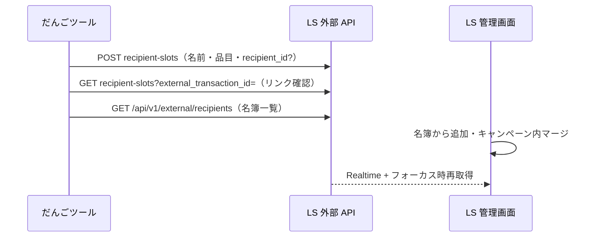

# ガチャ × だんごリンクシェア連携

開発者向け。ユーザー向けの操作説明は [HelpModal.tsx](../src/components/HelpModal.tsx)（`/gacha`）が正。

## 設計原則（ベストプラクティス）

| 関心事 | 正（SSOT） | だんごツール |
|--------|------------|--------------|
| 同一人物 | LS **受取人名簿** `recipients` | `Player.linkedRecipientId`（任意コピー） |
| キャンペーンへの載せ方 | 名簿から追加 / ガチャ API / チェックイン | `POST recipient-slots` |
| 同一キャンペーン内の重複枠 | LS **マージ** UI | 検知表示のみ（`GET recipient-slots`） |
| ガチャ・履歴 | ツール `gacha-players` | 正 |
| 配布 URL・ファイル | LS `claims` / `*_assets` | 冪等 POST で更新 |

**推奨運用（人物の統合）**

1. 受取人名簿にリスナーを登録（過去キャンペーンと共有可）
2. キャンペーンに **名簿から** 受取人を追加（ツール不要）
3. ガチャでプレイヤー追加 → 必要ならプレイヤーに **名簿を紐づけ**（二重枠を減らす）
4. 同じキャンペーンで枠が二重になったら → LS 管理画面で **マージ**
5. ツールは当選品目・表示名を **同期** するだけ

別キャンペーンをツールから直接マージ・結合する必要はない。

## 役割分担（API）

| 領域 | 備考 |
|------|------|
| プレイヤー一覧・抽選履歴 | `localStorage` `gacha-players` |
| 受取人スロット・Claim URL | LS 外部 API / DB |
| 品目↔アセット | `pool.items[].linkedAssetId` + `gacha-config` |

## 結びつけキー

- **冪等 ID**: `gacha-{poolId}-player-{playerId}` — `buildGachaPlayerExternalTransactionId()`
- **キャンペーン**: `pool.linkedCampaignId`
- **名簿（任意）**: `Player.linkedRecipientId` → POST body `recipient_id`
- **表示スコープ**: `playersForLinkedPool()` + `issuedCampaignId`

## 同期の方向

- **ツール → LS**: プレイヤー CRUD に伴う POST、リネーム、当選 `campaign_asset_ids`
- **LS → ツール**: `gacha-config` / `assets` 取り込み
- **人物の統合**: LS 名簿 + マージ（ツールは指示しない）

## 主要 API（file-share-app）

| メソッド | パス | 用途 |
|----------|------|------|
| GET | `/api/v1/external/recipients` | 名簿一覧（`campaigns:read`） |
| GET | `/api/v1/external/campaigns/[id]/recipient-slots?external_transaction_id=` | リンク有無確認 |
| POST | `.../recipient-slots` | Claim 発行・更新（`recipient_id` 任意） |
| DELETE | `.../recipient-slots?external_transaction_id=` | ツールからプレイヤー削除時 |
| PUT | `.../gacha-config` | 一括設定保存 |
| GET | `.../gacha-config` / `assets` | 取り込み |

表示名: [display-name.ts](../../file-share-app/src/lib/campaign-assets/display-name.ts)

マージ後の `slot_assets`: [recompute-slot-assets.ts](../../file-share-app/src/lib/claims/recompute-slot-assets.ts)

## Deep link

`{DANGO_TOOL}/gacha?campaign_id=...&open_bulk_modal=true&api_base_url=...`

## ツール側のリンク状態

- `usePlayerLinkStatuses`: `issuedClaimUrl` あり + GET で `linked: false` → **missing**（マージ・削除を疑う）
- 配布モーダル: 名簿選択 → `linkedRecipientId` 保存 → 再 POST

## 関連ファイル

**だんごツール**

- [src/lib/gachaDistribution.ts](../src/lib/gachaDistribution.ts)
- [src/app/gacha/hooks/useGachaEngine.ts](../src/app/gacha/hooks/useGachaEngine.ts)
- [src/app/gacha/hooks/usePlayerLinkStatuses.ts](../src/app/gacha/hooks/usePlayerLinkStatuses.ts)
- [src/components/gacha/PlayerLinkCollectionModal.tsx](../src/components/gacha/PlayerLinkCollectionModal.tsx)
- [src/components/gacha/GachaDistributionPanel.tsx](../src/components/gacha/GachaDistributionPanel.tsx)

**だんごリンクシェア**

- [src/app/api/v1/external/recipients/route.ts](../../file-share-app/src/app/api/v1/external/recipients/route.ts)
- [src/app/api/v1/external/campaigns/[campaignId]/recipient-slots/route.ts](../../file-share-app/src/app/api/v1/external/campaigns/[campaignId]/recipient-slots/route.ts)
- [src/hooks/features/campaigns/useCampaignDetail.ts](../../file-share-app/src/hooks/features/campaigns/useCampaignDetail.ts)
